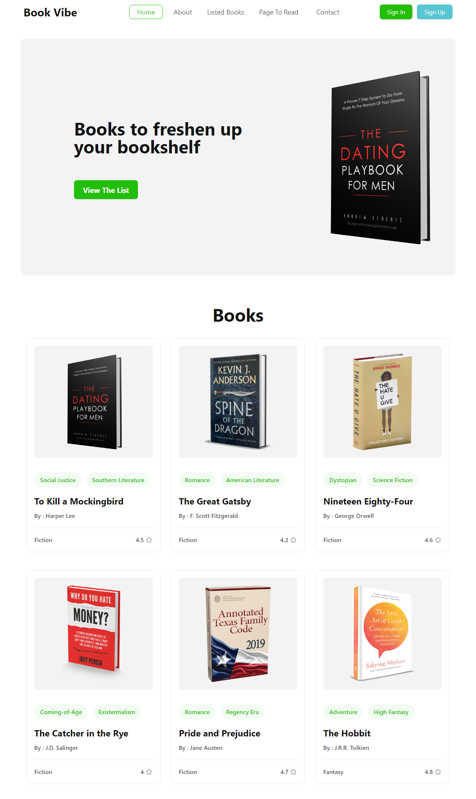

# Book Vibe

- [ Book Vibe ](https://react-book-vibes.netlify.app/)

* Responsive Design: The website is designed to be responsive, ensuring a seamless and optimized experience
  across various devices and screen sizes, including desktops, tablets, and mobile phones.
* User-friendly Interface: The website boasts an intuitive and user-friendly interface, making it easy for visitors
  to navigate, explore, and find relevant information about books, authors, and reviews.

* Dynamic Content: The website dynamically fetches and displays book information, including book covers, reviews, 
  and ratings, providing users with real-time and up-to-date data.

* Dynamic Sorting Options: Users can dynamically sort search results based on different parameters such as rating, 
  total pages, publish year, and more, giving them flexibility in organizing and exploring the available book catalog.

* Visual Representation: The website presents search results in a visually appealing manner, displaying book names
  along with their corresponding total pages in a graphical format, such as a bar chart or a scatter plot.

   1. Bar Chart: Each book name is represented by a bar, where the length of the bar corresponds to the total pages 
      of the book. Users can quickly compare the lengths of the bars to gauge the length of each book.

   2. Scatter Plot: The website may also utilize a scatter plot, where each point represents a book, with the 
       x-axis denoting the book name and the y-axis denoting the total pages. Users can hover over each point to view additional details such as the book name and total pages.

